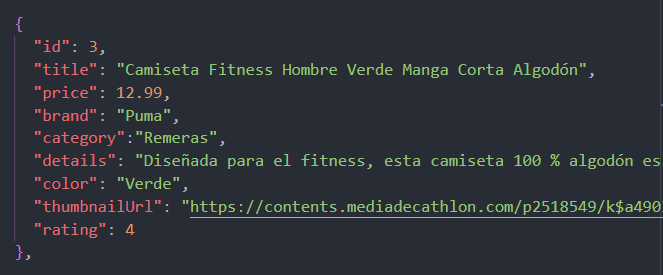

# Diplomatura UNTREF - App Decatlhon 🛍

Esta app replica la lógica de un e-commerce. Tiene diferentes funcionalidades, se pueden filtrar productos por Categorias, Colores o Marcas. Tambien un filtro dinámico que busca coincidencias por el título del producto mientras se escribe en un "imput".

## API

Los datos provienen de un archivo Json simulando la conexion con una API 

## Estructura y lógica de la aplicación 

La aplicacion cuenta con tre paginas
- Página principal 
- Pagina de descripción del Producto 
- Carrito de Compra 

En la pagina principal se puede filtrar por filtrar productos por Categorias, Colores o Marcas, tambien se puede buscar dinamicamente por productos. Se puede acceder al Carrito de Compras solo si hay algun producto cargado.

En la página de descripción del producto seleccionado se puede visualizar la información detallada, se puede agregar ese producto al carrito o volver a la página principal.
Si se  agrega un producto que ya existe en el carrito aumenta  la cantidad.
También se puede acceder al Carrito de Compras solo si hay algun producto cargado.

En la pagina del Carrito de  Compras se muestra una tabla con los productos cargados en el carrito donde  podemos aumentar o disminuir la cantidad del producto deseado, además de eliminar el producto. Se actualiza el resumen del carrito  con la cantidad de items y el  total a pagar. Key 3 botones [Pagar], [Vaciar Carrito] y [Volver]

[Pagar] y [Vaciar Carrito] solo aparecen si hay productos cargados.

[Pagar] Nos permite poner los datos del cliente y simular el pago, no genera un numero de operación de forma aleatoria con 6 dígitos.

[Vaciar Carrito] Vacía el carrito despues de confirmar si estamos seguros.

## Colores de Referencia

| Color             | Hex                                                                |
| ----------------- | ------------------------------------------------------------------ |
| --yellow | #f8d406 |
| --dark | #023447|
| --white | #ffffff |
| --plate  | #686666d7 |

## Fuente

Se utiliza la fuente "Roboto Condensed" de Google Fonts para el texto en todo el sitio, lo que aporta una apariencia moderna y legible.

 
## Authors

    github: @SebastianGallego

    Twitter: @stavelot78

